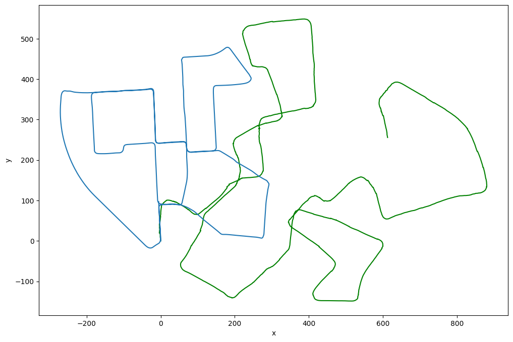
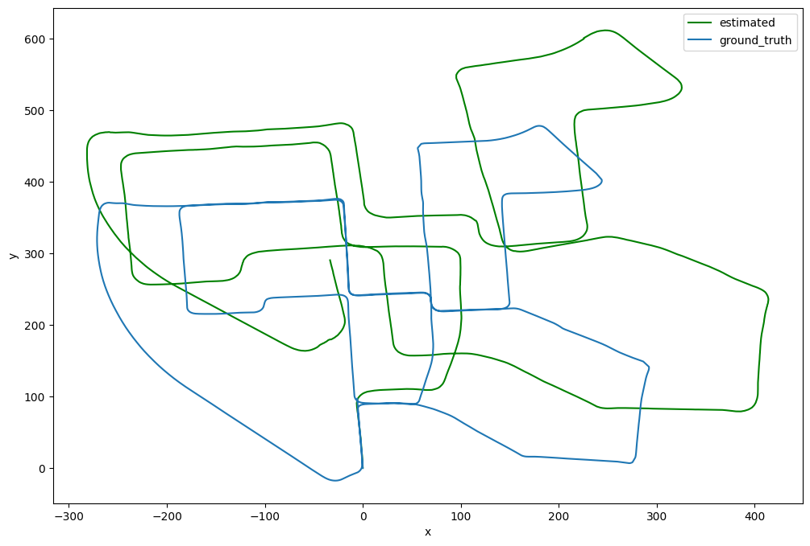
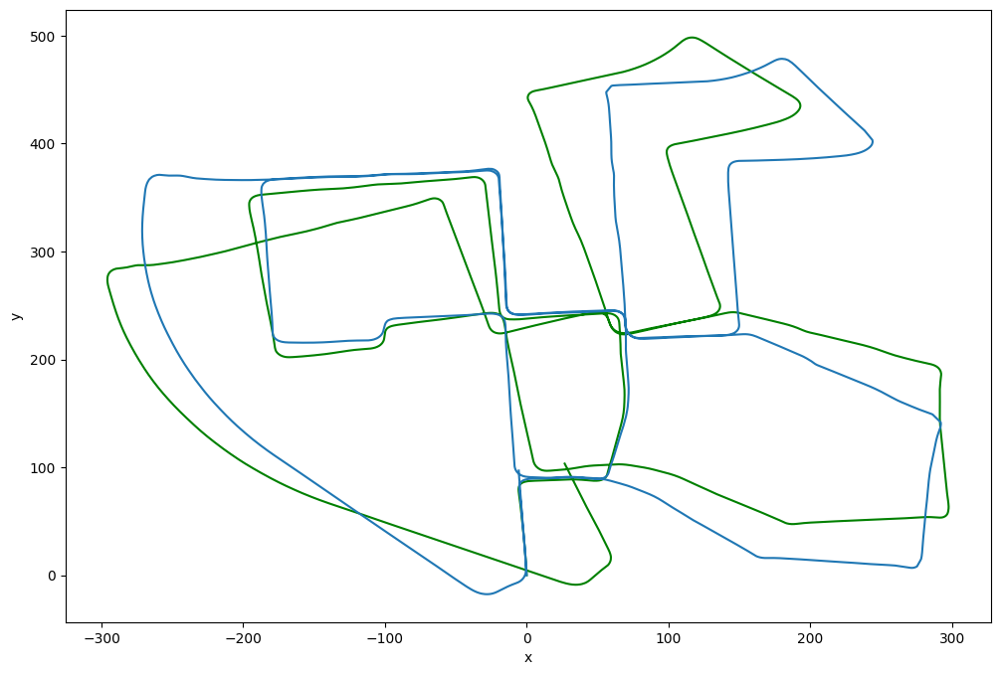

# CSL 7360 Computer Visison - Major Project

## Viusal Odometry

### Vision-based odometry allows a vehicle to localize itself robustly by using only a stream of images captured by a camera attached to the vehicle. Idea behind visual odometry is to track distinctive features in consecutive images and use the displacement of these features to calculate the camera or robot's motion relative to its surroundings.

## Dataset

The dataset used is KITTI dataset.
[Dataset Link](https://drive.google.com/drive/folders/103QjSUZ5UyEwjXnV2Zo2xKfF8T-J_9jL?usp=sharing)

## How to run the code

### Cloning the repo

    cd <path to clone the repo>

    git clone https://github.com/ayushabrol13/Visual-Odometry.git

### Changing directory to the cloned repo

    cd Visual-Odometry

### Creating a virtual environment

    pip install virtualenv

    virtualenv venv

    source venv/bin/activate

### Installing dependencies

    pip install -r requirements.txt

### Downloading the kitti dataset

[Dataset Link](https://drive.google.com/drive/folders/103QjSUZ5UyEwjXnV2Zo2xKfF8T-J_9jL?usp=sharing)

### Running the Monocular Visual Odometry

    python3 monoVisualOdometry.py

### Running the Feature Tracking

    python3 featureTracking.py

### Running the Stereo Visual Odometry

    python3 stereoVisualOdometry.py

### Complete Code

To run the complete code, run through the cells of ipynb notebook `CV_VO.ipynb`

### Results

[Output Drive](https://drive.google.com/drive/folders/1SzVFBnQekg8YmkzxzHSUDCo32bzh1i9i?usp=sharing)

#### Monocular Visual Odometry

#### Feature Tracking

#### Stereo Visual Odometry

## Project Demo Video

[Video Link](https://drive.google.com/file/d/1e0dL7yhV1OdzmVOEGxY5rJgAml2aKGdA/view?usp=drive_link)

## Code Inferencing Video

[Video Link](https://drive.google.com/file/d/1i7hOVp2kKO16eKng4IyJfpgktpq7tjEH/view?usp=drive_link)

## Collaborators

    Devyani Gorkar B20ME027
    Ayush Abrol B20AI052
    Anjali Agarwal B20AI051
    Aryan Tiwari B20AI056
